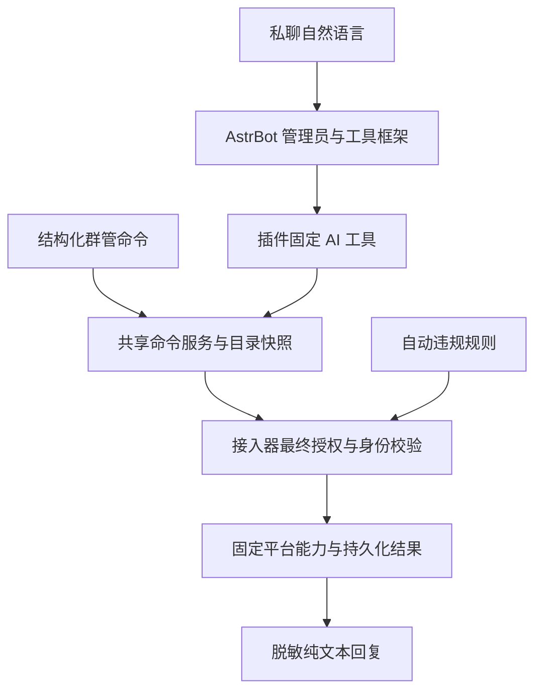

# 旺商聊群管与回复插件

## 私聊 AI 管理工具（待真实验收）

人格若使用工具白名单，须显式勾选 `wsl_private_management`；仅注册插件不会覆盖人格工具配置。开发门禁的私聊 AI 测试采用事件级中间回复缓冲，非流式结果合并后发送，避免准备说明先消耗唯一结果回复。窗口关闭后新的工具调用拒绝执行。

启用支持工具调用的模型后，私聊管理员可使用自然语言查询目录和执行已有六类管理动作。`wsl_private_management` 仅接受固定动作及独立参数，与 `/群管` 共用执行服务，不把模型输出当命令解析。普通用户与群聊不可使用。管理员身份、机器人动作授权和平台原生权限缺一不可。目标从十分钟目录快照选择，重名先追问；未知执行结果不继续处罚。工具不能修改授权或规则，也不提供任意消息撤回。



AstrBot 内置插件，为原生旺商聊接入器提供管理命令、自动违规规则，以及 AI 纯文本回复与敏感信息过滤。无需额外安装 Rust 服务。

## 职责与数据流

```text
旺商聊消息
  → 原生接入器：登录、收发、身份映射、机器人互斥
  → AstrBot：会话、管理员身份、命令分发
      → 群管插件：参数校验、目录选择、违规规则
          → 接入器固定能力：动作授权、平台权限、幂等、回执
      → AI：人格、模型、知识库、上下文
          → 插件：纯文本要求、结果整理、回复脱敏
  → 接入器发送回复
```

插件不维护第二套管理员系统，不通过聊天授予权限。平台原生群角色、机器人动作授权和 AstrBot 管理员身份是不同的检查，不能相互替代。

## 配置入口

1. 在「消息平台／创建或编辑机器人」完成登录、保存连接，选择启用的群。
2. 按需要开启私聊回复、各群回复和群管动作授权。普通群 AI 回复仍须明确 @ 当前机器人。
3. 私聊 `/sid` 获取身份，在 AstrBot 原有管理员配置 `admins_id` 中添加。不要用昵称猜测身份。
4. 自动违规规则在机器人配置中设置；未配置的动作不自动获得权限。

连接在线不代表授权已配置，也不代表每项平台动作都能执行。

## 私聊命令

普通用户可使用 `/help`、`/帮助`、`/群管帮助`、`/sid`、`/群管 我的权限`。普通咨询进入 AI 客服，受私聊回复开关、人格和模型配置控制。

下列查询和操作需要 AstrBot 管理员：

```text
/群管 群列表
/群管 选择群 1
/群管 成员列表
/群管 成员搜索 小明
/群管 禁言 2
/群管 解禁 2
/群管 踢出 2
/群管 公告 公告内容
/群管 全员禁言
/群管 解除全员禁言
/群管 能力
/群管 规则
/群管 违规计数
/群管 结果 <操作ID>
/群管 开发门禁
```

成员列表包含名字和业务 ID。编号来自当前目录快照，按机器人、操作人及私聊会话隔离，十分钟过期；重新列出或搜索后使用新的编号。聊天不能修改授权。

## 群内命令

群内只开放六项管理动作，不展示成员目录、权限或规则查询数据：

```text
@机器人 /群管 禁言 @成员
@机器人 /群管 解禁 @成员
@机器人 /群管 踢出 @成员
@机器人 /群管 公告 公告内容
@机器人 /群管 全员禁言
@机器人 /群管 解除全员禁言
```

通过客户端选择器真实 @。成员操作必须唯一识别一个目标；映射不明时拒绝，不按昵称匹配。命令不进入 AI，也不因命令正文包含违规关键词触发自动处罚。

## 自动违规处理

禁言与踢出使用独立关键词；同时命中以禁言为优先。首次违规在开启撤回时尝试撤回并 @ 警告，第二次执行相应处罚，计数窗口为 24 小时。冷却、身份核验、动作授权与幂等限制仍生效。任意手动撤回命令未提供，撤回通过自动违规入口处理。

操作状态应区分「服务端已接受」「已确认」「拒绝」「未知」。已接受不等于对端确认；未知结果不自动补发，不能反复提交处罚来试探。

## 纯文本与回复脱敏

旺商聊不支持富文本。帮助和查询使用【标题】、空行、编号；插件追加 AI 排版要求，不替换人格。普通 AI 结果中的 Markdown 转为文本，链接和代码保留原意，结构化 @ 不被改写，并关闭该结果的文字转图片。

回复过滤覆盖本插件命令结果和普通 AI 结果：

- 明确标注的 password、密码、验证码、API Key、Token、secret 等字段值。
- 常见 `sk-` 密钥、Bearer 凭证、JWT 和完整私钥块。
- 中国大陆 11 位手机号及常见邮箱，使用掩码展示。
- 业务 ID、群 ID、操作 ID 不进行无差别数字替换。

凭证过滤优先于代码及链接完整性，因此含认证参数的链接或示例代码会被遮盖。此功能是有限规则过滤，不是完整 DLP：无标签的任意密码、拆分或编码后的秘密可能无法识别；手机号形状的其他数字可能误判。第三方插件直接发送、主动发送、附件和流式路径不在本插件普通 AI 结果钩子的覆盖承诺内。

这不是入站脱敏：不阻止原始消息进入模型，不修改历史记录，也不清理框架日志。不要把回复过滤视为凭证存储或日志治理方案。

## 开发测试门禁

已接入的机器人默认相互排斥，即使是管理员也不例外。Dashboard 保存测试范围不会开启窗口，须单独开启。窗口仅存内存，最长五分钟、最多十次入站，重启、退出或替换账号后失效；一次仅支持一个指定发送实例。

- 私聊命令、群内命令、群内违规规则为独立范围。
- 群规则还需专用 `WSL_TEST_` 关键词及指定群。
- 后端 `private_ai` 范围用于单向普通私聊 AI 测试，当前尚无 Dashboard 选项。它不放行斜杠命令，不绕过私聊回复开关，每条仅允许一次关联回复。
- 反向继续互斥，避免结果触发机器人循环。
- 门禁不授予管理员身份、平台角色或机器人动作权限。

测试结束关闭窗口，恢复临时主动发送及其他测试配置。普通账号验收与受控机器人测试应分别记录。

## 常见问题

**帮助没有回复**：检查接收实例在线、允许私聊回复、插件启用状态。发送者若也是已接入机器人，检查门禁是否到期或因重启关闭；`ignored_bot` 表示互斥拦截，不代表管理员设置丢失。

**`private_peer_unknown`**：主动发送目标尚未成为本地已知会话；先用真实客户端建立私聊，不伪造消息记录。

**AI 回复慢**：区分模型生成、知识库查询、工具调用与平台发送。普通客服测试曾出现工具调用和超时，不应仅以连接在线认定稳定。

## 验证与边界

已有受控实测覆盖帮助入口、管理员查询、普通身份越权拒绝、普通私聊 AI 回复及两轮上下文。关闭私聊回复的线上测试已通过模型入口计数确认零调用；开启回复的对照组计数为一次。处理中撤销授权后未继续发出回复，群管执行也在变更前中止。群内未 @ 的线上零调用仍待独立验收。复杂排版的手机显示、任意秘密识别、完整普通外部账号验收及长期稳定性仍不能宣称全部通过。

```sh
uv run pytest tests/test_wangshangliao_text.py tests/test_wangshangliao_commands.py tests/test_wangshangliao_test_window.py
uv run ruff format .
uv run ruff check .
```

日志和标题由 AstrBot 核心负责：标题在列表、详情、搜索及导出保持一致。启用文件日志后可从当前文件恢复有限历史，每类最多读取末尾 4 MiB／1000 条，合并上限 2000 条；不加载更早轮转文件。已验证浏览器断网补发、服务重启恢复及 390 px 追踪页面换行。

成员分页使用 `/群管 下一页`，编号仅绑定当前页。警告发送状态独立于违规次数：明确失败先补警告，未知不重发且不进入处罚。操作结果通过接入器固定查询接口读取。开发测试只使用实例级门禁，旧环境变量不再生效。

Platform scope: moderation commands are filtered to the `wangshangliao` adapter. The plugin declares `support_platforms: [wangshangliao]`, so Telegram command registration excludes its commands. Existing runtime checks restrict moderation actions and presentation changes to Wangshangliao; the LLM hook also removes its management tool from unauthorized requests.

## 群名片任务

封禁（`ACCOUNT_STATE_BAN`）和注销（`ACCOUNT_STATUS_CANCELLED`）账号在预览及发送前排除。历史未知操作只做回读：若目标已封禁或注销，保留未知结果并隔离该目标，新任务可继续处理其他成员；隔离目标不会自动重试。普通账号的其他未知结果仍会暂停整个任务。

2026-09-20：指定测试群内普通成员 `D1 → 名片测试 → D1` 已完成两次平台目录回读确认，临时授权已恢复。自动进群、整批规范和手机对端观察仍待验收。Dashboard 单成员预览支持配对的 `card_member`、`card_name`，私聊 AI 不接受这些自由参数。

插件 `cards.py` 负责两字命名、持久化预览、任务与五分钟目录扫描；接入器 `rename_member()` 负责固定协议、最终授权、身份与原名校验以及回读。扫描不使用模型。

在消息平台逐群勾选名片动作授权并保存。自动开关另行开启，默认关闭。手动任务从 Dashboard 预览后执行，支持进度与停止。私聊管理员工具新增 `card_preview/card_execute/card_status/card_stop`，需要人格工具白名单启用 `wsl_private_management`。生成预览与明确执行必须是两条用户消息。

优先群名片，空白时用昵称；按 Unicode 字素取前两字符，不拆 Emoji；不足两字符生成并保存“大海群员＋六位数字”。排除已接入机器人、自己、群主与管理员。人工更改过的原名不覆盖。未知结果不重发，重启先回读。成员目录不完整或身份不一致时不执行。

语义执行门禁使用当前真实消息，不使用模型声称的授权；否定、查询、条件、引用需先澄清。规则门禁测试不等于真实模型自然语言验收，平台回读也不等于手机对端确认。

### 封禁／注销账号清理

Dashboard 的“成员批量操作”提供独立清理预览、确认、执行、进度及停止。需逐群授予 `cleanup`，不会继承 `kick` 或 `rename` 授权；默认不自动运行。只移出平台明确封禁／注销的普通成员，不删除账号，不按昵称推断。机器人及群管理角色保持保护。执行前重新校验，结果未知暂停回读，重启不续跑；清理记录与名片处理标记隔离。
