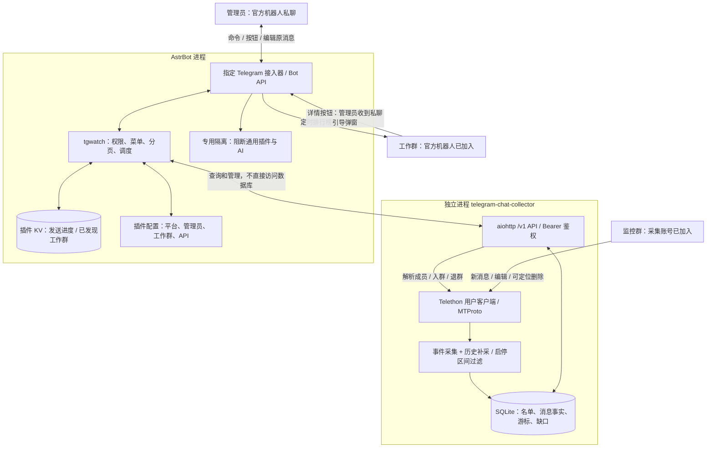
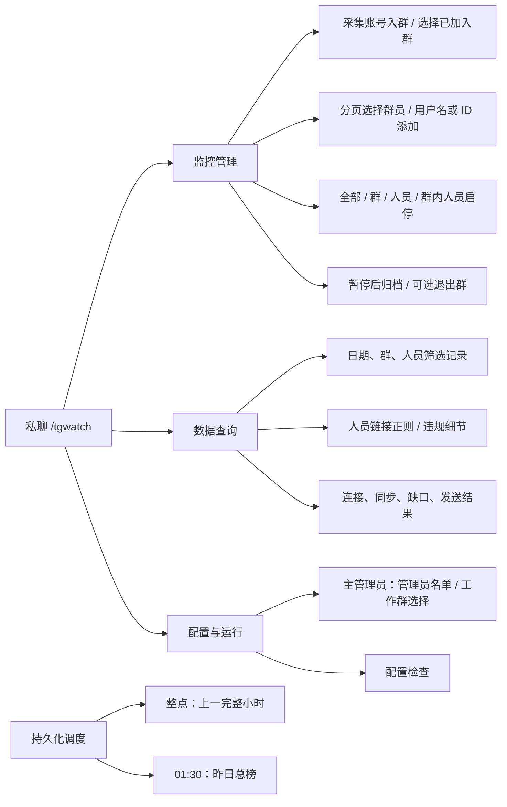
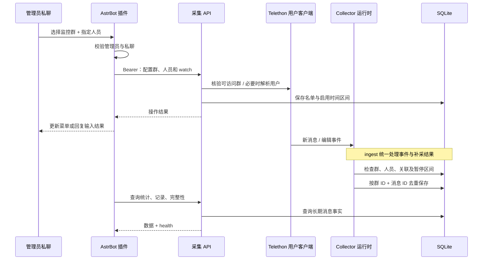
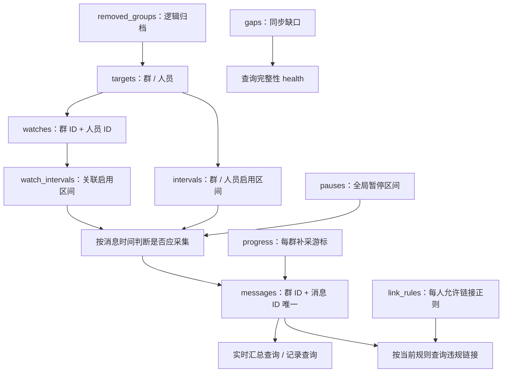
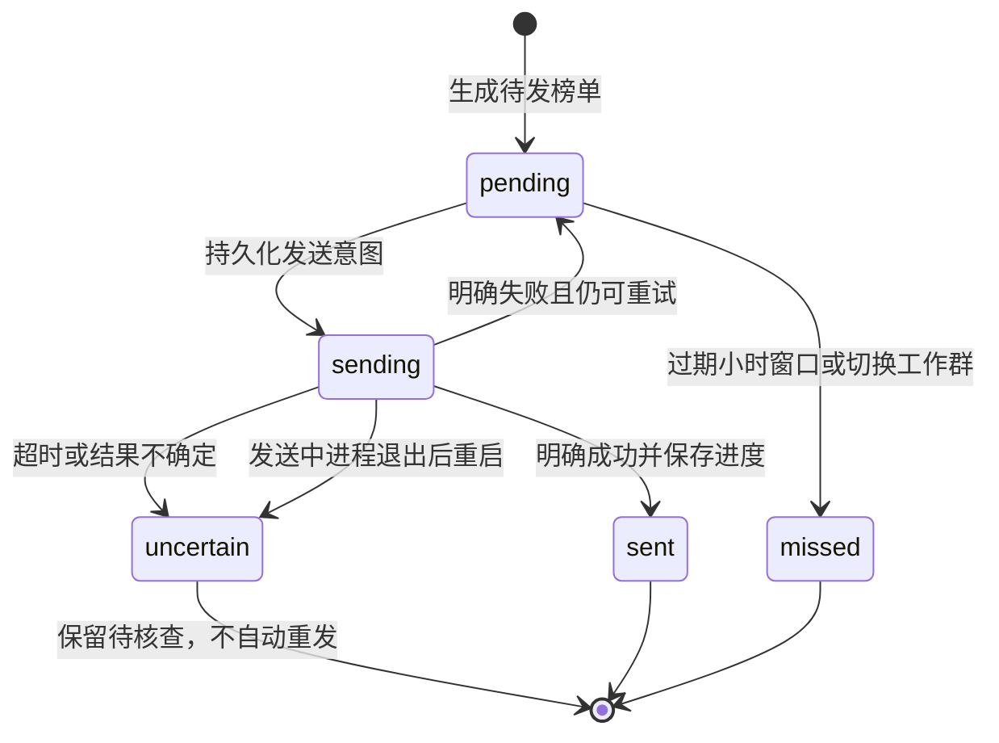

# Telegram 监控汇报机器人专属插件

`astrbot_plugin_tgwatch`（当前实现 v0.9.0）负责管理员交互和工作群排行榜；独立的 `telegram-chat-collector` 使用 Telethon 用户账号采集。两者通过鉴权 HTTP API 通信，不使用大模型，不自动代替人员发言。

## 文档导航

- [系统架构与账号边界](#系统架构与账号边界)
- [功能与权限](#功能与权限)
- [Telethon 开发架构](#telethon-开发架构)
- [配置与从零部署](#配置与从零部署)
- [管理员操作流程](#管理员操作流程)
- [统计与发送规则](#统计与发送规则)
- [日志、维护与故障排查](#日志维护与故障排查)
- [开发与验收](#开发与验收)

## 系统架构与账号边界



| 对象 | 身份与职责 | 不承担的职责 |
| --- | --- | --- |
| Telethon 采集账号 | 真实 Telegram 用户账号；加入监控群、接收事件、读取可访问历史、解析成员 | 不发布工作群榜单，不接收管理员验证码 |
| 官方汇报机器人 | BotFather 创建，Token 配置在 AstrBot；菜单、按钮和榜单 | 不用于读取其他群的完整聊天历史 |
| 监控群 | 配置群与人员关联后采集指定人员 | 不会因加入账号就自动开始监控 |
| 工作群 | 允许定时发送榜单的群，可同时开启多个 | 不会因接收榜单就自动成为监控群 |

两个账号互相独立：采集账号入群不代表官方机器人入群，机器人入群也不代表采集账号能够读该群。切换工作群不会让任何账号自动退出旧群。

### AstrBot 隔离

插件仅绑定配置中的一个 `platform_id`，复用现有适配器的 `application`，不创建第二个 Bot 轮询。插件注册命令、`tw:` 回调和专用更新拦截器；重载、卸载及适配器重建时清理或重新绑定处理器与调度任务。

接入器启用 `telegram_dedicated_reporting`（专用汇报机器人隔离）后，即使插件停用，通用消息流水线仍保持静默。专属会话配置应关闭 AI，仅启用本插件，并将该平台会话路由到该配置。关闭平台的通用命令注册与自动刷新，由本插件维护菜单。

`support_platforms` 是兼容性声明，不是全局隔离开关。`wangshangliao_moderation` 的平台过滤与入口检查属于它自己的隔离；不能用这份声明代替汇报机器人的专用隔离。

## 功能与权限



| 能力 | 主管理员（`admin_ids` 第一项） | 其他管理员 | 普通用户 |
| --- | --- | --- | --- |
| 阅读工作群已发排行榜 | 可以 | 可以 | 可以 |
| 私聊监控配置、入群、暂停、删除、查询 | 可以 | 可以 | 不可以 |
| 查询聊天原文、违规细节和详细状态 | 可以 | 可以 | 不可以 |
| 添加、移除其他管理员 | 可以 | 不可以 | 不可以 |
| 选择工作群、启停榜单 | 可以 | 不可以 | 不可以 |

所有按钮重新校验身份；名单发现不授予权限。主管理员不能通过机器人移除，首次身份只能从可信的 AstrBot 配置设置。管理员增删同步到插件配置，该文件为权威名单，重载不会恢复已移除管理员。

### 交互规范

- 私聊按钮编辑原消息；长内容在原消息中翻页，不逐条发送新消息。命令和主动文本输入可以产生新消息。
- 群内详情按钮仅向管理员弹窗引导打开私聊菜单，不在群里展示详情，也不额外发送私信。普通用户无查询权限。
- 插件重载后旧分页缓存可能失效，重新发送 `/tgwatch` 打开菜单。
- 输出使用 Telegram MarkdownV2，标题加粗，动态名称及原文安全转义，消息类型使用中文。
- 🟢 表示启用、开启、恢复或正在监控；🔴 表示关闭、停用或暂停。按钮颜色对应将执行的动作，状态颜色对应当前状态；工作群按钮颜色表示当前发榜授权状态，点击切换。
- 定时输出仅保留排行榜；管理员将工作群由红色切换为绿色时，向该群发送一次启用成功确认（含北京时间发榜安排）。关闭、刷新、重载不发送确认，发送结果不确定不自动重试。异常、恢复、违规不主动发通知；交互失败可以在当前操作页面提示。

## Telethon 开发架构

### 模块职责

以下采集模块均位于相邻 `telegram-chat-collector/collector/`：

| 模块 | 责任 |
| --- | --- |
| `__main__.py` | CLI、本地登录、客户端和服务生命周期、维护及恢复入口 |
| `runtime.py` / `Collector` | 新消息/编辑/删除处理、统一入库、按群补采、连接与采集状态 |
| `store.py` / `Store` | SQLite 模式、启停区间、去重、消息查询、统计、保留期清理 |
| `api.py` | Bearer 鉴权、名单与查询接口、调用 Telethon 解析/入退群 |
| 插件 `main.py` | API 客户端、Telegram 处理器、权限、输出、发送状态机 |
| 插件 `_conf_schema.json` | AstrBot 可见插件配置字段 |



事件处理属于采集服务内部 `runtime.py`，不是 Telegram 调用 HTTP API。实时事件与历史补采共用入库规则，避免两套计数逻辑。

### 数据模型与采集边界



首次启用从启用时刻开始，不导入更早历史；暂停不删除记录，恢复不补算暂停区间。同一人员可在多个群分别建立监控关联。只建立人员档案不会自动监控全部群。

普通消息按消息 ID 计 1 条，包括贴纸、媒体、转发；相册逐条计。编辑更新原文而不增加次数；服务通知和无法识别实际人员的匿名/频道身份不归入个人统计。不下载媒体文件，只保留文字/配文、类型和可用回复关联。

可定位群的删除事件会隐藏正文与链接，但保留已观察到的次数。不保证收到所有删除事件。原文及链接保留 90 天，清理后长期保留非正文消息事实用于计数和去重；当前实现是查询事实汇总，**没有独立日汇总表**。

补采游标与实时处理分离，实时消息不会提前推进历史游标。断线后尽力恢复仍可访问且处于启用区间的消息；缺口单独保留。已恢复缺口不等于从未漏采，断线期间已删除消息可能永远无法恢复。

### 用户账号生命周期与 RPC

本地 `login` 输入手机号、验证码、两步验证密码，生成 `var/account.session`；机器人不接收这些凭据。登录命令和运行服务不要同时占用会话。账号未授权时通过状态返回 `login_required`，后台不交互索要验证码。

API 中需要访问 Telegram 的操作通过服务客户端执行，相关 RPC 使用锁协调，并处理 Telegram 等待/限流。入群结果不确定时不盲目重试；先核验可访问群，需审批的群显示等待审批。服务独立于 AstrBot，AstrBot 停止不会停止采集；休眠和断网期间不能实时采集。

### API 开发约定

默认 `http://127.0.0.1:6190/v1`，所有业务端点要求 `Authorization: Bearer <api_token>`。时间使用带时区 UTC ISO 格式，窗口为左闭右开 `[start, end)`。插件不直接读写 SQLite。

| 方法 / 资源 | 用途 |
| --- | --- |
| GET `status` | 连接、名单、进度、缺口及当前统计状态 |
| GET/PUT `control` | 全局暂停 |
| GET `dialogs`、`resolve`、`members` | 已加入群、解析人员、群员分页 |
| GET/PUT `groups`、`people`、`watches` | 群、人员、群内关联配置 |
| PUT `join` | 用户账号按公开群或邀请链接入群 |
| PUT `remove_group` | 已暂停群逻辑归档，`leave` 决定是否退出 |
| GET `stats`、`messages` | 排名与记录；包含完整性状态 |
| GET/PUT `link_rules` | 人员正则规则 |
| GET `violations` | 按游标扫描违规链接 |

鉴权错误 401、参数错误 400、上游或存储不可用 503；不可用不是零数据。完整参数、运行和备份命令见 [采集服务文档](../../../../telegram-chat-collector/README.md)。

## 配置与从零部署

### 四类配置不能混淆

| 配置位置 | 内容 | 修改方式 |
| --- | --- | --- |
| AstrBot `data/cmd_config.json` 中 Telegram 接入器 | Bot Token、稳定的平台 ID、专用隔离、通用命令开关 | AstrBot 后台；平台 ID 不作为显示名随意修改 |
| AstrBot `data/config/abconf_*.json` 及平台路由 | 专属会话配置，关闭 AI，仅选择本插件 | AstrBot 配置与会话路由界面 |
| AstrBot `data/config/astrbot_plugin_tgwatch_config.json` | 插件启用、平台绑定、管理员、工作群、采集 API | 插件配置；部分字段由私聊管理同步保存 |
| 相邻采集服务 `config.json` | API ID/hash、会话/数据库路径、API 密钥、代理 | 本地 `setup` 或编辑私有配置 |

插件 KV 保存报表发送状态、已发现工作群等运行信息；分页和未完成输入属于内存态，重载会失效。不要把 KV 当作管理员配置的权威来源。

| 插件字段 | 说明 |
| --- | --- |
| `enabled` | 默认关闭，完成基础配置后启用 |
| `platform_id` | AstrBot 接入器 ID，不是机器人用户名或 Telegram 用户 ID |
| `admin_ids` | 数字 ID 列表，首项为主管理员 |
| `api_url` | 默认 `http://127.0.0.1:6190`，不包含 `/v1` |
| `api_token` | 与采集服务一致的随机 Bearer 密钥 |
| `work_chat_id` | 旧版单群配置，仅首次迁移；之后以私聊工作群开关为准 |
| `reports_enabled` | 旧版单群开关，仅首次迁移；各群开关保存在插件 KV |

### 安装顺序

1. 在采集服务目录运行以下命令，已有配置不要重复 `setup`：

   ```sh
   cd /Users/xinxinzi/Documents/ChatGPT/telegram-chat-collector
   uv sync
   uv run tg-collector --config config.json setup
   uv run tg-collector --config config.json login
   uv run tg-collector --config config.json doctor
   uv run tg-collector --config config.json run
   ```

2. BotFather 创建官方机器人，在 AstrBot 接入器配置 Token 和固定平台 ID，启用专用隔离，关闭通用命令注册及自动刷新。
3. 安装插件，设置平台 ID、主管理员数字 ID、采集 API 地址与密钥，然后启用。插件目录是 `data/plugins/astrbot_plugin_tgwatch`；可分发包位于采集服务 `dist/astrbot_plugin_tgwatch.zip`。
4. 建立专属会话配置：关闭 AI，只启用本插件，绑定该平台会话路由。配置文件中不要使用真实凭据作为共享示例。
5. 主管理员私聊机器人点击 Start，发送 `/tgwatch`，执行“配置检查”。通过“工作群设置”拉机器人入群、点击群名变为绿色。
6. 配置采集账号的监控群和人员，使用可控测试群核对采集与榜单，再按采集文档配置 launchd 常驻和备份。

`tg-collector` 命令必须在采集项目目录运行，或显式使用 uv 的 `--project`。在 AstrBot 目录直接运行可能报 `Failed to spawn: tg-collector`。路径按实际安装位置替换。

## 管理员操作流程

### 监控群与人员

私聊 `/tgwatch` → 开始监控 → 选择采集账号已加入的群 → 分页选择群员，或输入数字 ID、`@用户名`、`t.me/用户名`、`https://t.me/用户名`。可追加工作显示名。群员每页最多 10 人；机器人、已删除账号和采集账号不参与选择。隐藏群员或无法解析用户名时使用数字 ID。

输入等待 10 分钟，`/cancel`、返回菜单或插件重载取消。群和人员必须建立本群关联才开始监控。总开关、群开关、人员开关和本群人员开关共同决定生效；恢复总开关不会覆盖其他暂停设置。

“➕ 加入群聊”接收公开群链接、`t.me/+邀请码` 或 `t.me/joinchat/邀请码`，由 **Telethon 用户账号** 入群，不会自动监控群员。待审核时等通过后再刷新；不接受个人或广播频道链接。

“群与监控人员”先 🔴 暂停群，才出现“🗑 删除／退出”。选择仅归档，或归档并让采集账号退出；历史记录保留，群内监控关联停用。重新添加后需明确恢复人员监控，不会删除 Telegram 群本身。

### 工作群选择与通知

主管理员可随时进入“📣 工作群设置”，不局限首次安装：

1. “➕ 拉机器人入群”打开官方 Telegram 添加群界面，加入的是 **官方机器人**。
2. 返回刷新列表。入群事件不限制邀请人；群更新也可记录群。刷新仅通过官方 Bot 核验已记录群的成员身份，不访问采集账号。
3. 若历史入群事件错过，在目标群发送 `/tgwatch@机器人用户名` 后刷新，或输入群 ID 添加。Bot API 没有被本插件用于直接枚举全部已加入群的接口，刷新不是无限范围群搜索。
4. 列表中直接点击群名切换：🟢 允许该群定时发榜，🔴 不向该群发榜；开启时核验机器人发言权限。新发现群默认红色。

每个群独立开关，可同时开启多个群。没有“当前工作群”或单独的“启用榜单”按钮。入群事件或刷新确认机器人已退出时，移除对应候选与开关；网络错误不会视为退群。开关不改变人员采集或链接规则。发送进度按群隔离，旧版发送状态迁移以避免重复发送。

### 记录、状态与违规链接

记录按日期、人员、群筛选，每页最多 10 条：

```text
/tgwatch records YYYY-MM-DD [人员ID] [群ID]
/tgwatch status
/tgwatch pause
/tgwatch resume
/cancel
```

“运行状态”查看连接、总开关、有效监控人数、每群今日条数、最近消息、最后同步、当前未闭合缺口、历史缺口、漏榜和待核查发送。开关为绿色不代表网络一定健康。榜单里的人员状态是发送时状态，不是历史在线时长。

“🔗 链接规则”按人员设置允许链接正则，每行一条，最多 10 条、每条 500 字符；完整 URL 匹配任一规则即允许，未配置不检查。例如：

```text
https://t\.me/example_user/?
```

“🚫 违规细节”显示姓名、群、时间、消息编号和不匹配链接，不主动告警。每页最多 10 条违规消息，每批最多扫描 200 条；无违规不代表全部历史无违规，可继续下一批。按照当前启用规则重算保留原文，规则修改会改变历史查询结果，不是不可变处罚记录。新数据包含 URL 实体与隐藏链接目标，旧数据不能还原未存储的隐藏目标；删除或过期隐藏链接，正则超时明确报错。

## 统计与发送规则

时区为 `Asia/Shanghai`：整点发上一完整小时，15:00 对应 `[14:00, 15:00)`；另显示所属自然日累计及参与群数。00:00 榜单对应昨日 `[23:00, 24:00)`。每日 01:30 发昨日 `[00:00, 次日00:00)` 总榜，不包含发送当天凌晨消息。

并列按数字 ID 稳定排序，使用显式排名数字及奖牌，条目以人员名称开头。零消息显示 0，查询失败不显示假零榜；存在采集缺口时标注可能不完整。



多段榜单逐段保存进度。小时榜只在整点后 5 分钟内尝试，重启不补旧小时榜，过期小时漏发记录保留最近 30 天；日榜只补最近一份已到时间的漏榜。首次安装不追溯安装前小时榜。明确失败可以按窗口重试，结果不确定需管理员到工作群核对，不提供盲目自动重发。

## 日志、维护与故障排查

| 内容 | 去向与行为 |
| --- | --- |
| 插件日志 | `self.logger` → AstrBot 日志系统 / WebUI 日志流 |
| 采集进程日志 | 本地 `var/collector.log`、launchd 输出文件；未汇聚到 AstrBot |
| 连接、同步、缺口 | `/v1/status` → 私聊状态查询；不主动通知 |
| 聊天原文 | SQLite → 鉴权查询 → 管理员私聊；不输出运行日志 |
| 发送结果 | 插件 KV → 状态查询；不确定不自动重发 |

日志不输出 Token、API 密钥、会话和聊天原文。采集日志 2 MiB 轮转保留 5 份；维护任务对服务输出文件按 2 MiB 截断归档、保留 3 份。

采集与 AstrBot 独立启停。launchd 模板位于采集服务 `deploy/`，默认在用户登录后运行；不要同时启动手工采集进程。定期维护示例每天本机时间 03:15，一致性备份保留 14 份，含数据库、配置和发送状态，不含登录会话。归档含密钥及原文，权限 0600。

```sh
cd /Users/xinxinzi/Documents/ChatGPT/telegram-chat-collector
uv run tg-collector --config config.json maintenance --astrbot-root /Users/xinxinzi/Documents/ChatGPT/AstrBot
uv run tg-collector restore /path/to/backup.zip /path/to/new-data-directory
```

恢复目标必须是全新目录。恢复后重新登录；切换前停旧采集服务。AstrBot 配置和 KV 按采集文档分别恢复，不能拿插件 KV 覆盖整个 AstrBot 数据库。未恢复发送状态可能重复最近日榜，启用前核对工作群。

| 现象 | 核查方向 |
| --- | --- |
| 机器人已入群但列表没有 | 刷新；群内定向命令补记；手工群 ID；官方机器人历史事件限制 |
| 采集不可用 | 服务端口、双方 API 密钥、`doctor`、账号连接及限流；不能判断为零消息 |
| 有消息但未计数 | 群/人员/watch/总开关、消息时间是否在启用区间、发送者是否匿名身份 |
| 按钮无效或分页过期 | 重新 `/tgwatch`，核对数字 ID 权限与当前平台绑定 |
| 工作群没有榜单 | 工作群红绿开关、Bot 成员及发言权限、发送窗口和 KV 状态 |
| 保存提示 Bot id cannot be changed | 保持既有接入器 ID；修改显示名称与修改平台身份不是同一操作 |
| 删除按钮未显示 | 先暂停该监控群；工作群选择不是监控群删除操作 |

## 开发与验收

在 AstrBot 根目录执行项目检查，另显式覆盖可能被根目录忽略的插件目录：

```sh
ruff format .
ruff check .
ruff format data/plugins/astrbot_plugin_tgwatch
ruff check data/plugins/astrbot_plugin_tgwatch
.venv/bin/python -m pytest data/plugins/astrbot_plugin_tgwatch/tests -q
```

采集服务目录运行 `uv run pytest -q`、`uv run ruff format .`、`uv run ruff check .`。升级 AstrBot 或 python-telegram-bot 后重点检查共享 application、处理器顺序、重载清理及原消息编辑。插件扩展采集 API 时同步更新双方实现、接口文档与测试；只有变更 AstrBot 后端 API/Schema 时才按项目要求生成前端客户端。

测试覆盖去重与编辑、启停边界、统计窗口、鉴权、分页、发送结果、工作群发现及归档退出等。模拟客户端测试不等于实际账号验收。现场用可控测试群核对：已知数量文字/媒体、编辑、删除、暂停后发言、恢复；再检查非管理员拒绝、按钮原地更新、工作群切换与启用、AstrBot 停止期间持续采集，以及整点/01:30 实际榜单。真实退群和删除测试应使用可丢弃测试群。

### 运行状态分类菜单

“运行状态”只展示分类按钮：采集账号、工作群、监控群、监控人员、榜单发送、采集缺口。点击后原消息显示该分类详情；监控群再点群名查看，人员每页 10 人。每页提供刷新与返回。分类首页、工作群与发送情况不依赖采集 API，因此采集离线仍可查看这些页面。

### AstrBot 接入错误处理

命令菜单注册失败不会阻断榜单调度；按至少 5 分钟退避重试，限流等待更长时遵从等待时间。循环错误日志标识适配器绑定或报表调度环节和异常类型，连续同类错误不刷屏，不记录异常原文。按钮页面网络更新失败不自动重复执行操作，通过当前点击提示重新打开菜单；不额外向群推送故障通知。

### 恢复验证范围

回归测试包含：采集连接失败后关闭并重新打开 SQLite，补采与实时重复消息合并后数量保持一致；插件从持久化发送状态重新初始化，已成功日榜不重复、发送中状态转换为待核查、过期小时榜不补发。网络异常由模拟客户端注入，不等于真实 Telegram 网络中断演练。

本机备份恢复演练使用当前在线一致性备份，在临时私有目录运行真实 restore 命令，对数据库执行完整性检查，并核对数据库内容哈希、插件配置与发送状态导出一致。恢复副本不连接 Telegram，验证后临时目录清除，原服务不受影响；尚未覆盖新机器重新登录及整个 AstrBot 实例切换。
